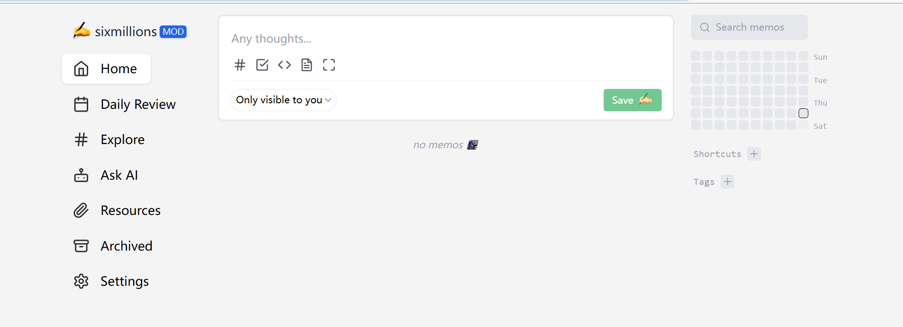
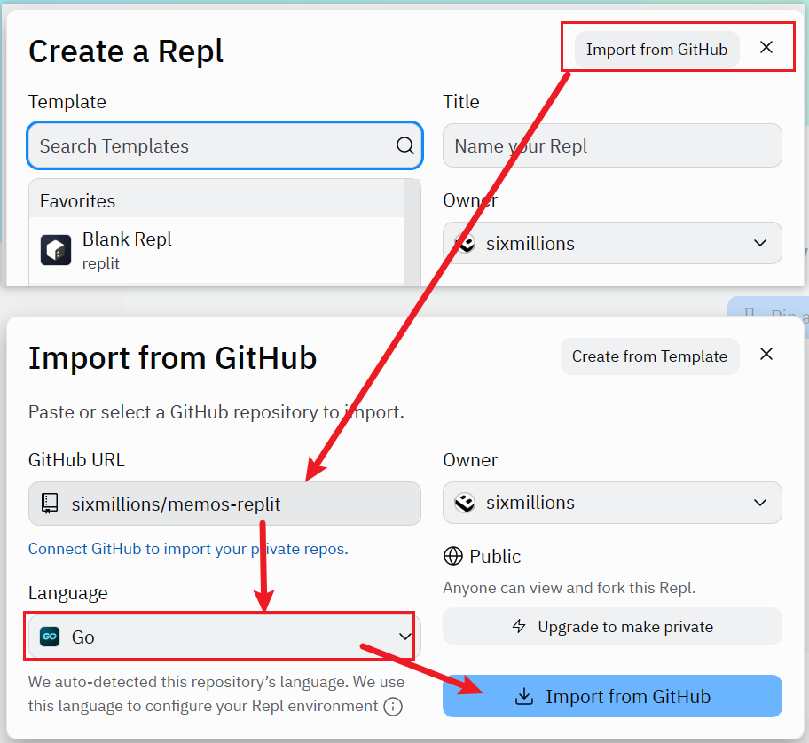
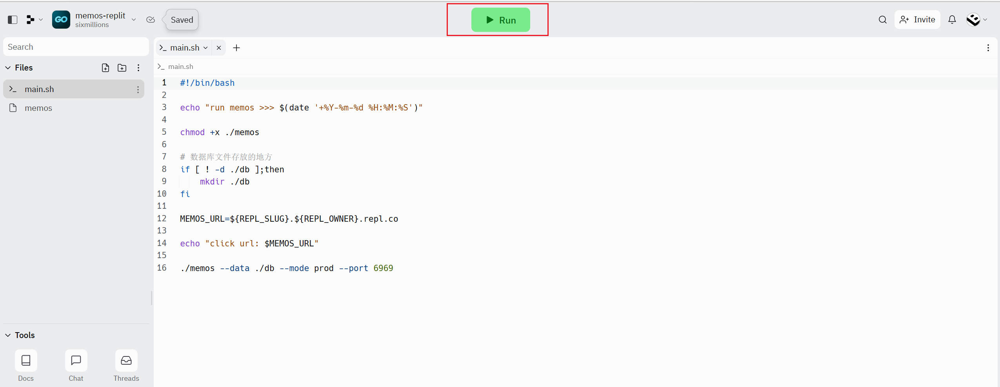
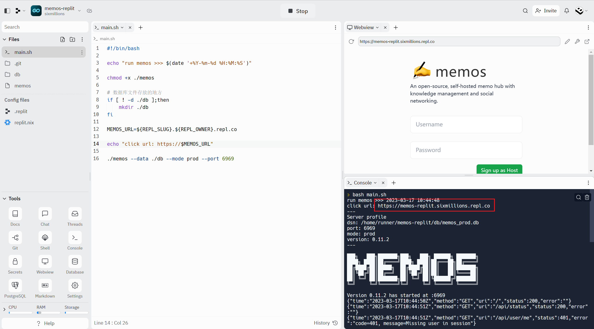

# 介绍

在[replit](https://replit.com)上运行最新版[memos](https://github.com/usememos/memos)(v0.12.2)

> https://replit.com  
> https://github.com/usememos/memos  



# 版本升级

目前还不是自动构建，有新版memos可以email我一下，我快速构建一下

**升级一时爽，数据火葬场！！！！注意备份数据**

```bash
# 先备份数据
zip memeos-db.zip -qr db/*
# 然后下载该数据，这个就是你的数据库

# 备份旧的memos
mv memos memos.bk

# 安装最新版（本项目构建的最新版）
bash main.sh

# 或者指定版本（本项目构建的某个版本）
bash main.sh v0.12.2
```

- v0.12.2 最新
- v0.11.2

# 运行

## 方式1

1. 打开我创建的[模板地址](https://replit.com/@sixmillions/memos-replit)
2. 点击右上角 `Use Template`


## 方式2

1. clone本项目到replit，语言选择go
2. 运行main.sh







**注意：** 
- 检查 `.replit` 文件（点击`Files` 最右边三个点，选择 `Show hidden files`, 就能看到该文件）
- 这种方式导入，有时候replit会覆盖这个文件
- 如果发现和本项目不一样，重新copy一份进去，然后刷新页面重新进一下这个项目

## 方式3

1. 参考下面的[构建方式](#构建方式)构建出memos
2. 将memos上传到replit
3. 运行main.sh

# 构建方式

## 构建思路

1. replit中go语言环境使用的是 **ubuntu20.04**
2. 用**同样的环境**构建出memos，例如: [gitpod](https://gitpod.io)，docker
3. copy构建出来的可执行文件到replit上运行

## 具体步骤

以v0.11.2为例

### clone memos项目

```shell
git clone https://github.com/usememos/memos.git
# 切换到具体版本
cd memos && git checkout v0.11.2
```

### 构建前端

需要有node环境（略）

我这里用的具体版本是：

- node 16.19.0 
- yarn 1.22.19

```shell
# 在项目根目录下
cd ./web 

# web目录下
yarn && yarn build
```

将构建前端文件copy到 `server/dist` 下

```shell
# 回到项目根目录
cd ..
rm -rf ./server/dist && cp -r web/dist ./server/
```

### 构建memos

需要安装go语言环境（略）

我用的go语言版本是: go version go1.19.5 linux/amd64

```shell
# 回到项目根目录
go build -o memos ./main.go
```

这样就构建出来 `memos` 这个可执行文件了，在项目根路径

# 防止replit休眠

如果长时间不操作replit，replit会进入休眠

我们这里需要隔一段时间访问一下，使用定时任务

方式：

## linux系统crontab

```shell
2 * * * * curl 你memos地址 >/dev/null 2>&1
```

## cron-job

使用[cron-job](https://cron-job.org)效果一样 

注册cron-job -> 创建cron-job -> 配置cron-job -> 运行cron-job


# 自定义域名解析

在replit上添加自定义域名


然后域名解析配置一下，我这里用的是cloudflare

添加 `cname` 和 `txt` 解析


# 最后

感谢Memos开源社区的各位大佬

