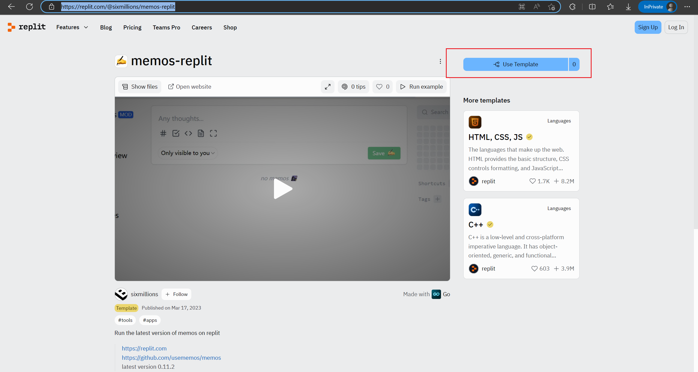
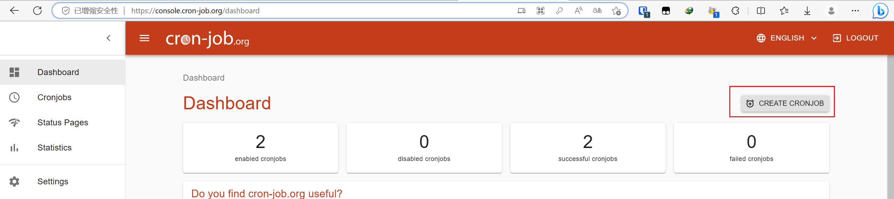
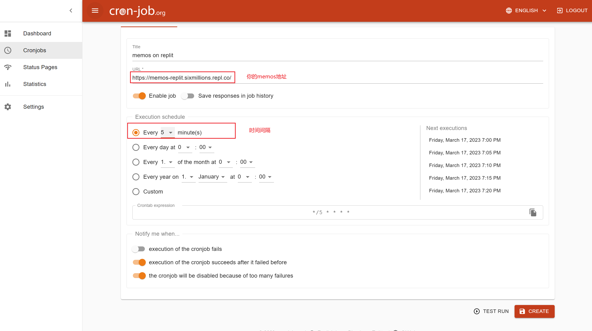
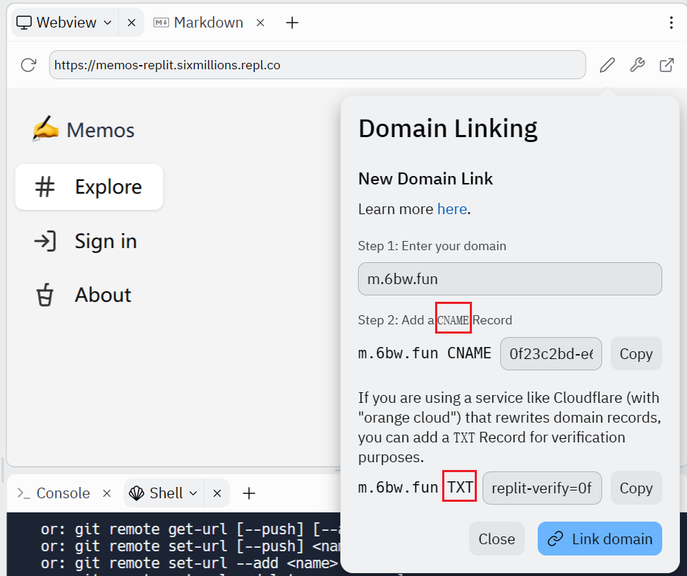
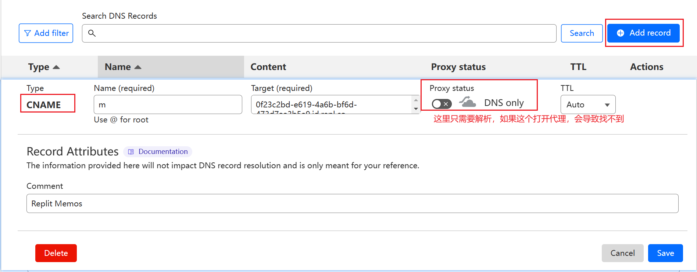
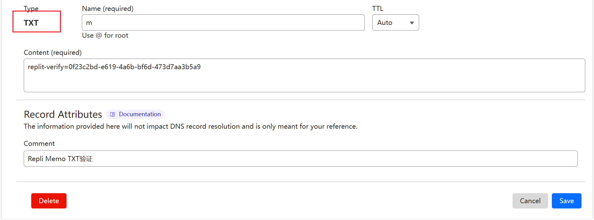

# 介绍

在[replit](https://replit.com)上运行最新版[memos](https://github.com/usememos/memos)(v0.21.0)

> https://replit.com  
> https://github.com/usememos/memos  

# 版本升级

目前还不是自动构建，有新版memos可以email我一下，我快速构建一下

**升级一时爽，数据火葬场！！！！注意备份数据**

```bash
# 先备份数据
zip memeos-db.zip -qr db/*
# 然后下载该数据，这个就是你的数据库

# 备份旧的memos
mv memos memos.bk

# 安装最新版（本项目构建的最新版）
bash main.sh

# 或者指定版本（本项目构建的某个版本）
bash main.sh v0.12.2
```

- v0.21.0 **最新**
- v0.13.1 
- v0.13.0 [升级问题](./docs/qa/v0.13.0.md)
- v0.12.2
- v0.11.2

# 运行

## 方式1

1. 打开我创建的[模板地址](https://replit.com/@sixmillions/memos-replit)
2. 点击右上角 `Use Template`



# 防止replit休眠

如果长时间不操作replit，replit会进入休眠

我们这里需要隔一段时间访问一下，使用定时任务

方式：

## linux系统crontab

```shell
2 * * * * curl 你memos地址 >/dev/null 2>&1
```

## cron-job

使用[cron-job](https://cron-job.org)效果一样 

注册cron-job -> 创建cron-job -> 配置cron-job -> 运行cron-job





# 自定义域名解析（TODO：好像不支持了）

在replit上添加自定义域名



然后域名解析配置一下，我这里用的是cloudflare

添加 `cname` 和 `txt` 解析





# 私有问题

replit免费版本，所有项目都是公开的，所以任何人都可以看到你的文件，包括数据库

既然任何人都可以查看，所以不要用来存重要数据或者隐私数据

## 教育版本（replit将废弃该版本）

对于教育版本是可以创建私有项目的

1. 选择teams，然后填写信息。`Team display name` 随便填写， `Team username` 是要拼接到url的，比如我填写的是 `old-six`
2. 紧接在这个team里面创建项目，`Tile` 如果和上面的 `Team username` 不一样就会拼到url中，如果一样，就只显示一个，所以为了之后访问url简短，这里我也用 `old-six`
3. 最后我的访问地址就是 `old-six.repl.co`，如果上面两个名字不一样就是 `pjname.teamname.repl.co`

# 最后

感谢Memos开源社区的各位大佬

