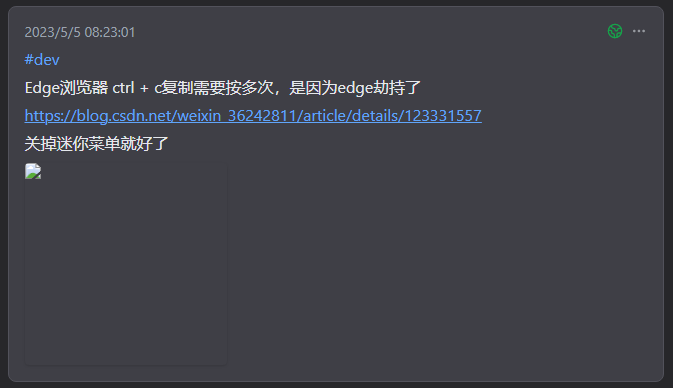
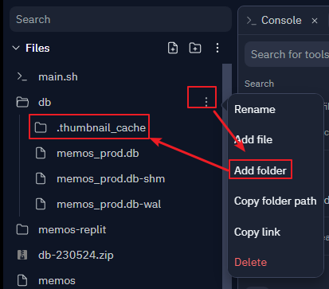

## 升级到v0.13.0版本

升级后，图片无法显示，如下图


单独访问该图片连接报错

```json
{
  "error": "code=500, message=Failed to resize thumbnail image: /home/runner/sixpx/db/.thumbnail_cache/4bbb983b-4385-45c6-006c-001d68accfb8.png, internal=open /home/runner/sixpx/db/.thumbnail_cache/4bbb983b-4385-45c6-006c-001d68accfb8.png: no such file or directory",
  "message": "Failed to resize thumbnail image: /home/runner/sixpx/db/.thumbnail_cache/4bbb983b-4385-45c6-006c-001d68accfb8.png"
}
```
控制台报错
```json
{
  "time": "2023-05-25T00:21:01Z",
  "method": "GET",
  "uri": "/o/r/16/4bbb983b-4385-45c6-006c-001d68accfb8/2739689612.png?thumbnail=1",
  "status": 500,
  "error": "code=500, message=Failed to resize thumbnail image: /home/runner/sixpx/db/.thumbnail_cache/4bbb983b-4385-45c6-006c-001d68accfb8.png, internal=open /home/runner/sixpx/db/.thumbnail_cache/4bbb983b-4385-45c6-006c-001d68accfb8.png: no such file or directory"
}
```

分析报错，memos图片缓存到`.thumbnail_cache`路径  
但是replit上没有该路径（权限太小，无法自动创建）  
我们手动创建一下这个文件夹，重新进入即可   
右键 `db` -> `Add folder` -> `.thumbnail_cache`

